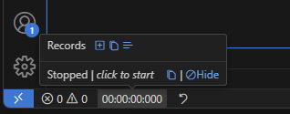

# Light Stopwatch

A light stopwatch with milliseconds in statusbar.

## Features

- Stopwatch with interval 50ms on statusbar
- Opt-in records function in tooltip
- Copy time/records to clipboard

## Extension Settings

This extension contributes the following settings:

* `light-stopwatch.defaultShow`: Extension is visible by default.
* `light-stopwatch.enableRecords`: Enable records function.
* `light-stopwatch.defaultAbsRecrod`: Records display in absolute elapsed time by default.

## Known Issues

Any records changes (add, mode switch) will NOT be visible unless tooltip is hide and show again.

## Release Notes

### 1.0.0

Initial release
